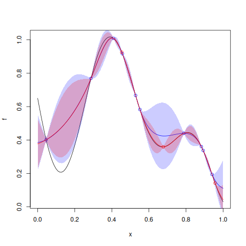

# `Kriging::update`


## Description

Update a `Kriging` model object with new points (added permanently).


## Usage

* Python
    ```python
    # k = Kriging(...)
    k.update(y_u, X_u)
    ```
* R
    ```r
    # k = Kriging(...)
    k$update(y_u, X_u)
    ```
* Matlab/Octave
    ```octave
    % k = Kriging(...)
    k.update(y_u, X_u)
    ```


## Arguments

Argument      |Description
------------- |----------------
`y_u`     |     Numeric vector of new responses (output).
`X_u`     |     Numeric matrix of new input points.


## Examples

```r
f <- function(x) 1- 1 / 2 * (sin(12 * x) / (1 + x) + 2 * cos(7 * x)*x^5 + 0.7)
plot(f)
set.seed(123)
X <- as.matrix(runif(10))
y <- f(X)
points(X, y, col = "blue")

k <- Kriging(y, X, "matern3_2")

x <- seq(from = 0, to = 1, length.out = 101)
p <- k$predict(x)
lines(x, p$mean, col = "blue")
polygon(c(x, rev(x)), c(p$mean - 2 * p$stdev, rev(p$mean + 2 * p$stdev)), border = NA, col = rgb(0, 0, 1, 0.2))

X_u <- as.matrix(runif(3))
y_u <- f(X_u)
points(X_u, y_u, col = "red")

## change the content of the object 'k'
k$update(y_u, X_u)

x <- seq(from = 0, to = 1, length.out = 101)
p2 <- k$predict(x)
lines(x, p2$mean, col = "red")
polygon(c(x, rev(x)), c(p2$mean - 2 * p2$stdev, rev(p2$mean + 2 * p2$stdev)), border = NA, col = rgb(1, 0, 0, 0.2))
```

### Results
```{literalinclude} ../functions/examples/update.Kriging.md.Rout
:language: bash
```

