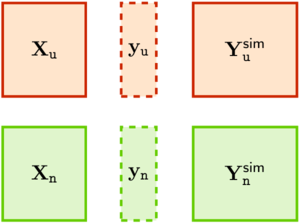
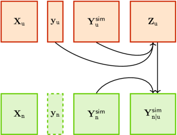
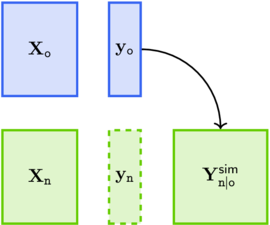
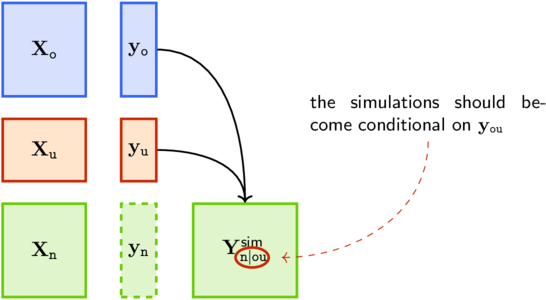
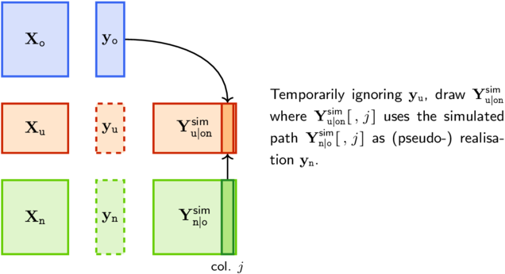
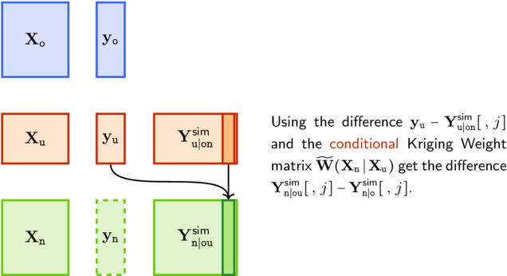

(SecUpdate)=
# Update model objects and simulations

## Notations and problems

Throughout this section the following notations will be used for
design matrices $\m{X}$ and vectors of observations $\m{y}$.

- $\Old{\m{X}}$: contains $\Old{n}$ observed or "old" design
  points. The corresponding vector of observations $\Old{\m{y}}$ is *known*.

- $\New{\m{X}}$: contains $\New{n}$ "new" design points at which a prediction or
  a simulation is made. The corresponding vector of observations
  $\New{\m{y}}$ is *unknown*.

- $\Upd{\m{X}}$: contains $\Upd{n}$ "update" design points. The
  corresponding vector of observations $\Upd{\m{y}}$ is *unknown* but
  becomes available at some point where an update step can be
  performed.

All the design matrices have the same number of columns which is the
number of inputs $d$. The letters $\told$, $\tnew$ and $\tupd$ are not
symbols, hence are not italicized.

**Note**. The notations of this section differ from those of the [Predict
and simulate](SecPredAndSim) section where no "update" design and
observations are used. The correspondence for "old" and "new" objects
is $\Old{\m{X}} \leftrightarrow \m{X}$ and $\New{\m{X}}
\leftrightarrow \m{X}^\star$.

The two following problems are considered

- **Update a Kriging model object** Suppose that a Kriging model has
   been fitted by using the "old" design $\Old{\m{X}}$ and the "old"
   observations $\Old{\m{y}}$. Later on, the "update" vector of
   observations $\Upd{\m{y}}$ corresponding to the "update" design
   $\Upd{\m{X}}$ becomes available. We then want to update the fitted
   Kriging model object. The resulting updated model object should be
   identical to the model that would be obtained by using the design
   $\m{X}_{\told\tupd}$ binding the rows of the two designs
   $\Old{\m{X}}$ and $\Upd{\m{X}}$, along with the vector of
   observations $\m{y}_{\told\tupd}$ stacking $\Old{\m{y}}$ and
   $\Upd{\m{y}}$.

- **Update conditional simulations** Suppose as before that a Kriging
   model has been fitted by using the "old" design $\Old{\m{X}}$ and
   the "old" observations $\Old{\m{y}}$. Using this model, conditional
   simulations have been computed for the "new" design points in
   $\New{\m{X}}$. This means that $m$ simulated paths have been
   computed on $\New{\m{X}}$. Later on, the "update" vector of
   observations $\Upd{\m{y}}$ corresponding to the "update" design
   $\Upd{\m{X}}$ becomes available. We then want to update the
   $m$ simulations so that they become conditional on $\Old{\m{y}}$ *and
   on* $\Upd{\m{y}}$.

Of course we want each of the two *update* steps to be faster than the
computation "from scratch" of the Kriging model or of the simulations
using the observations $\m{y}_{\told\tupd}$. For the second problem, we
rely on the *FOXY algorithm* of {cite:t}`ChevalierEtAl_FOXY` allowing
the *fast update of conditional simulations*.

In **libKriging** the two problems above corresponds to two methods
for the Kriging models classes : `update` and `update_simulate`. The
`update` method updates a Kriging model object. The `update_simulate`
method can update the conditional simulations that are attached to the
object. These simulations must have previously been attached by using
the `simulate` method with the corresponding option.

We consider here only non-noisy models for which the notion of path is
clear. Hints are given on the noisy case at the very end of this
section.

## Updating a fitted Kriging model object

Remind that when fitting a Kriging model object with observations
$\Old{\m{y}}$ the costly step is the computation of the Cholesky
decomposition of the covariance matrix $\OldOld{\m{C}} :=
\m{C}(\Old{\m{X}}, \, \Old{\m{X}})$. This step costs $O(\Old{n}^3)$
elementary operations.

The Cholesky decompostion can be performed by blocks, see
{cite:t}`GolubVanloan_MatrixComputations`. The decomposition of the
covariance matrix $\m{C}(\m{X}_{\told\tupd},\, \m{X}_{\told\tupd})$
takes the form

$$ 
   \begin{bmatrix}
      \OldOld{\m{C}} & \OldUpd{\m{C}} \\
	  \UpdOld{\m{C}} & \UpdUpd{\m{C}} 
   \end{bmatrix}  =
   \begin{bmatrix}
      \OldOld{\m{L}} & \m{0} \\
	  \UpdOld{\m{L}} & \UpdUpd{\m{L}} 
   \end{bmatrix} 
   \begin{bmatrix}
      \OldOld{\m{L}}^\top & \UpdOld{\m{L}}^\top \\
	  \m{0} & \UpdUpd{\m{L}}^\top 
   \end{bmatrix} =
   \begin{bmatrix}
      \OldOld{\m{L}}\OldOld{\m{L}}^\top & \OldOld{\m{L}}\UpdOld{\m{L}}^\top \\
	  \UpdOld{\m{L}}\OldOld{\m{L}}^\top & \UpdOld{\m{L}}\UpdOld{\m{L}}^\top + 
	  \UpdUpd{\m{L}}\UpdUpd{\m{L}}^\top 
   \end{bmatrix},
$$

where the matrices $\OldOld{\m{L}}$ and $\UpdUpd{\m{L}}$ are lower
triangular with positive diagonal elements. So, $\OldOld{\m{L}}$ is
the Cholesky factor of $\OldOld{\m{C}}$ hence is available at the
update time. 

When $\Upd{n}$ is small relative to $\Old{n}$, the update is faster
than a fit using the observations $\m{y}_{\told\tupd}$. This is
especially true when $\Upd{n} = O(1)$ while $\Old{n}$ is large.

## Updating simulations

### The Kriging weights

An useful tool related to the update of simulations from a Kriging model
is the so-called *Kriging weights* matrix or function.

For a given Kriging model the prediction is linear w.r.t. to the observations
and takes the form

$$ 
  \widehat{\m{y}}_{\tnew\vert\told} = \m{W}(\New{\m{X}} \vert \Old{\m{X}}) \,
  \Old{\m{y}} 
$$

where $\m{W}(\New{\m{X}} \vert \Old{\m{X}})$ is a $\New{n} \times
\Old{n}$ matrix of *Kriging Weights*. In this notation, the pipe
$\vert$ does not stand as usual for conditioning since $\Old{\m{X}}$
and $\New{\m{X}}$ are not random. Yet this recalls that the Kriging
Weights depend on the two designs, keeping these in the same order as
in our notations for conditioning. Also, it emphasizes the fact that
the matrix is a function of the two design matrices and that it does
not depend on the GP values.

The matrix of Kriging weights is given by

$$
  \m{W}(\New{\m{X}} \vert \Old{\m{X}}) = \NewOld{\m{C}} \OldOld{\m{C}}^{-1} 
$$

in the SK case, and by 

$$
  \m{W}(\New{\m{X}} \vert \Old{\m{X}}) = 
  \left\{ \NewOld{\m{C}} + 
  \left[ \New{\m{F}} - \widehat{\m{F}}_{\tnew\vert\told}
  \right] \Cov(\widehat{\bs{\beta}}) \, \Old{\m{F}}^\top
  \right\} \OldOld{\m{C}}^{-1} 
$$

in the UK case, where $\widehat{\m{F}}_{\tnew\vert\told}$ is the SK
prediction of $\New{\m{F}}:=\m{f}(\New{\m{X}})$ given the observations
$\Old{\m{F}}$.

### Update non-conditional simulations: residual Kriging

Suppose first that we have a Simple Kriging model (with no trend) and
that we have performed a non-conditional simulation for a design with
two parts $\Upd{\m{X}}$ and $\New{\m{X}}$. The $m$ simulated paths are
stored in matrices $\m{Y}^{\texttt{sim}}_{\tupd}$ and
$\m{Y}^{\texttt{sim}}_{\tnew}$ with dimensions $\Upd{n} \times m$ 
and $\New{n} \times m$.

If at some point the vector $\Upd{\m{y}}$ of observations becomes
available, we can turn the non-conditional simulations in
$\m{Y}^{\texttt{sim}}_{\tnew}$ into conditional ones, say
$\m{Y}^{\texttt{sim}}_{\tnew\vert\tupd}$. In the vocabulary of data
assimilation we may say that we are updating the simulations
$\m{Y}^{\texttt{sim}}_{\tnew}$ by assimilating the observations
$\Upd{\m{y}}$. 
 
It is easy to show that the conditional simulations can be obtained by
using

$$
\m{Y}^{\texttt{sim}}_{\tnew \vert \tupd}[ \: ,\, j] := 
\m{Y}^{\texttt{sim}}_{\tnew}[\:,\, j] +  
\m{W}(\New{\m{X}} \vert \Upd{\m{X}}) \left\{\Upd{\m{y}} - 
\m{Y}^{\texttt{sim}}_{\tupd}[\:,\, j] \right\} \qquad j=1,\, \dots,\, m.
$$

The vector $\Upd{\m{y}} - \m{Y}^{\texttt{sim}}_{\tupd}[\:,\, j]$ may
be called a "residual" hence the name of this simulation method. The
$m$ residuals can be stored as the columns of a $\Upd{n} \times m$
matrix $\Upd{\m{Z}}$.

This method has been called *residual Kriging* by
{cite:t}`ChevalierEtAl_FOXY`, yet it has been used earlier without
this name by {cite:t}`HoffmanRibak_GaussianFields` and by
{cite:t}`DurbinKoopman_Simulation`.

In the case where an Universal Kriging model is used, one can not
obtain non-conditional simulations because the unconditional
distribution of $\m{y}$ is improper. However the residual Kriging can
be used conditionally on observations $\Old{\m{y}}$ corresponding to a
design $\Old{\m{X}}$. 

### Update conditional situations: FOXY

Consider now the case where the simulation is conditional on
observations $\Old{\m{y}}$ corresponding to a design $\Old{\m{X}}$. We
can relax the no-trend assumption of the previous section and simply
assume that the distribution conditional on $\Old{\m{y}}$ is proper
i.e., that $\Old{\m{F}} := \m{F}(\Old{\m{X}})$ has full column rank.

Then the observations $\Upd{\m{y}}$ at some "update" design points
$\Upd{\m{X}}$ become available, and we want to update the simulations
stored in $\m{Y}^{\texttt{sim}}_{\tnew \vert \told}$

Following {cite:authors}`ChevalierEtAl_FOXY` we can use the Kriging
residual algorithm above but *conditionally on* $\Old{\m{y}}$. So we
have to consider the conditional covariance Kernel

$$
  \widetilde{C}(\m{x}, \, \m{x}') :=
  \Cov\{y(\m{x}),\, y(\m{x}') \, \vert\, \Old{\m{y}}\}.
$$
 
This kernel expresses as

$$
\begin{aligned}
\widetilde{C}(\m{x}, \, \m{x}')
	&= C(\m{x},\, \m{x}') -C(\m{x}, \,\m{X}_{\told}) \m{C}_{\told,\told}^{-1}\, 
C(\m{X}_{\told},\, \m{x}) \\
      &+ \left[\m{f}(\m{x}) 
- \widehat{\m{f}}(\m{x}) \right]^\top \Cov(\widehat{\bs{\beta}})
\left[\m{f}(\m{x}) 
- \widehat{\m{f}}(\m{x}) \right]
		\end{aligned}
$$
  
We can then use the residual Kriging algorithm. Yet we do not in
general know the value of the simulated paths on the $\Upd{\m{X}}$,
hence we can not straightforwardly compute the residuals for the
design points in $\Upd{\m{X}}$. So the FOXY algorithm proceeds in two
steps

- **Step 1** Extend the simulated paths to the design points in
  $\Upd{\m{X}}$

- **Step 2** Use the residual Kriging algorithm with the conditional 
kernel $\widetilde{C}(\m{x}, \, \m{x}')$.
  
Step 1 uses the conditional mean $\mathbb{E}(\Upd{\m{y}}
\vert \m{y}_{\told\tnew})$ and covariance
$\textsf{Cov}(\Upd{\m{y}} \vert \m{y}_{\told\tnew})$, the mean being
computed by using the Kriging weights $\m{W}(\Upd{\m{X}} \vert
\m{X}_{\told\tnew})$. In step 2, one uses the Kriging weights
$\widetilde{\m{W}}(\New{\m{X}} \vert \m{X}_{\tupd})$ related to the
conditional kernel $\widetilde{C}(\m{x},\, \m{x}')$. Note that 
the observations $\Upd{\m{y}}$ are used only in step 2.

{cite:t}`ChevalierEtAl_Update` give nice update formulas for the Kriging
weights.

## The noisy case

Remind that the `simulate` method for the class `"NoiseKriging"` draws
either *non-noisy* or *noisy* paths from the Kriging model. Referring
to the notations used in the last sub-section of the [Prediction and
simulation](predictSimulate) section, the simulated non-noisy paths
embed a *smooth process* part $\eta(\m{x})$ which is the sum of
the linear trend and the GP components

$$
   \underset{\textsf{smooth process}}{
	   \underbrace{{\eta}(\m{x})}
	}
	= \underset{\textsf{trend}}{
		\underbrace{\m{f}(\m{x})^\top \bs{\beta}}
	} + 
    \underset{\textsf{GP}}{
        \underbrace{\zeta(\m{x})}
    }.
$$
The simulation essentially generates random draws $\bs{\eta}^{\star[j]}$
for the value of the smooth process $\eta(\New{\m{x}})$ at the new
design points given $\New{\m{X}}$.

When the `simulate` method is used, the random draws returned in a
matrix $\m{Y}_{\tnew \vert \told}^\tsim$. These can be either
non-noisy or noisy with the provided noise variance $\New{\sigma}^2$.
By using the `will_update` option, the simulations and the
corresponding parameters can be attached to the Kriging model
object. If so, the `update_simulate` method can be used later. The
"update" observations then provided in $\m{y}_{\tupd}$ are assumed to
be noisy with a noise $\sigma_{\tupd}^2$ which can be zero.

Note that when $\sigma_{\tupd}^2$ is very large, the "update"
observations provide only little information about the process part
hence the predictions and simulations from the updated model should be
close to those arising from the original model.
